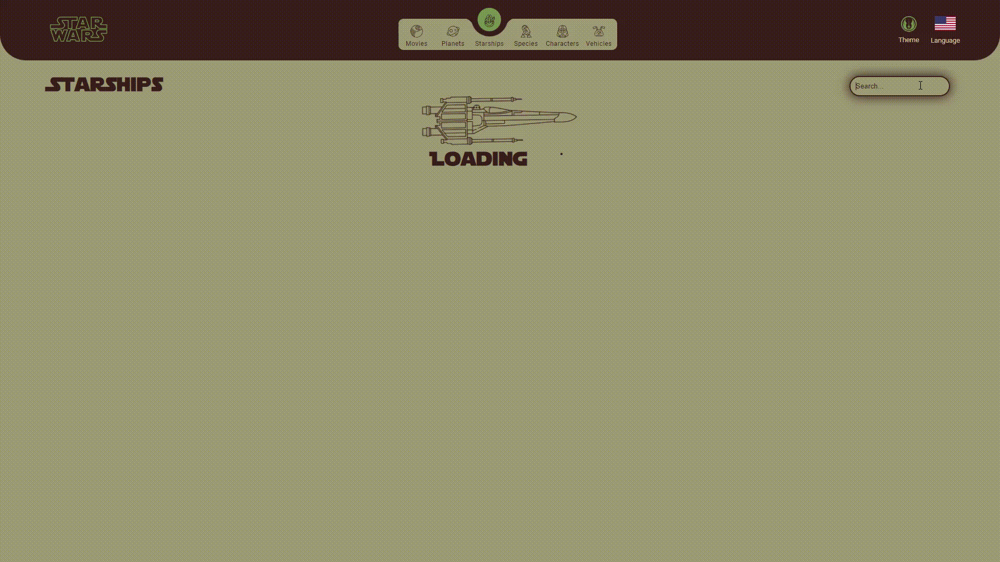
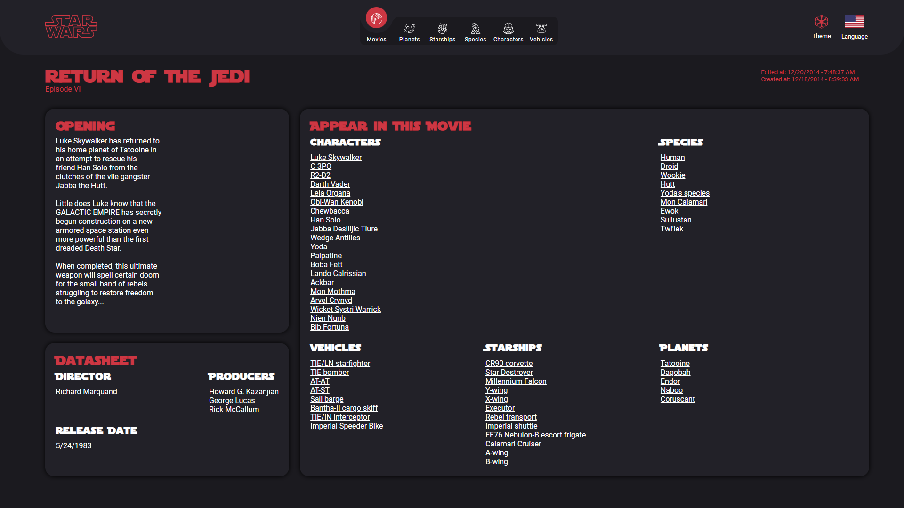
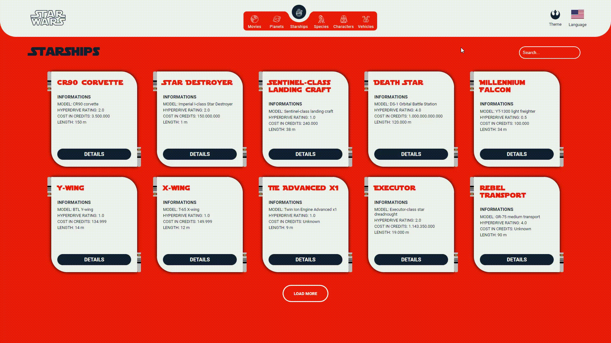

# About the project

The project was created in order to serve as a portfolio, showing some skills I have in web application development. [Star Wars Front-end](https://starwars-front.vercel.app/) is an application that displays some information about the first 6 films in the Star Wars cinematic universe. The idea was to create a website that consumes the information provided by the API [SWAPI](https://swapi.dev/) and displays it in a creative way that makes reference to existing elements in the Star Wars world.

# Functionalities

## List of information categories

The information displayed on the platform is provided only by [SWAPI](https://swapi.dev/). Being them:

[Movies](https://starwars-front.vercel.app/movies/),
[Planets](https://starwars-front.vercel.app/planets/),
[Starships](https://starwars-front.vercel.app/starships/),
[Species](https://starwars-front.vercel.app/species/),
[Characters](https://starwars-front.vercel.app/characters/) e
[Vehicles](https://starwars-front.vercel.app/vehicles/).

## Category content filter

## Information pagination

## Detailed content

## Change of themes

In order to provide a more interesting visual experience for different types of profiles. 5 themes were implemented that make references to the Star Wars universe, namely:

**_Sith, Jedi, Empire, Alliance, R2D2_**

## Translation of static fields

Unfortunately, SWAPI does not have portability for different types of languages, so only the translation of the fields defined in the front-end into two languages was done: American English and Brazilian Portuguese.

## Technologies used

The project was developed using the tools: ReactJs, Typescript, Vite, Recarts, Styled-components, React-router, I18next and React-spring.

# Running the project

1. Install dependencies with: `npm install`
2. Run the project on port 3000 with the command: `npm run dev`
3. Generate the project build: `npm run build`

# Did you like the project? You can contribute with:

## Ideas, Reviews or with a job vacancy ;)

You can contact me on [Linkedin](https://www.linkedin.com/in/eduardo-nunes-081951151/). Or you can create an issue here in the repository :D

## Adding more languages

To add a new translation, follow the 4 steps:

1. Inside the `locales` folder, create a folder whose name must be the code of the language to be added (Ex: pt-br, es-es, en-us), in lower case. After the folder is created, inside the created folder, add a `translation.json` file. This will translate the terms into the new language that the platform will support.
2. Add the language code (Ex: pt-br, es-es, en-us) to the `supportedLngs` list, in the `i18n.ts` file
3. Add a _.svg_ image with the flag representing the new language in the `~/assets/icons/flags/` folder.
4. In the `~/utils/languages_icons.tsx` file, add to the `LANGUAGES_ICONS` object the key that is the language code and as value the _.svg_ of the flag added in the previous step.

## Adding more themes

To add a new theme variation, follow the steps below:

1. Create a _.ts_ file, whose filename is the name of the new theme, inside the `~/styles/themes/` folder. It should follow the pattern defined in the `~/styles/styled.d.ts` file.
2. Add a _.svg_ image with the icon representing the new theme in the `~/assets/icons/themes/` folder, preferably in circular format.
3. In the `~/styles/themes/themes_dict.tsx` file, add the name of the new theme as a key of the `THEMES` object, and as a value an object with two keys, being them style (object containing the style of the theme, defined in step 1) and icon (theme icon defined in step 2).
