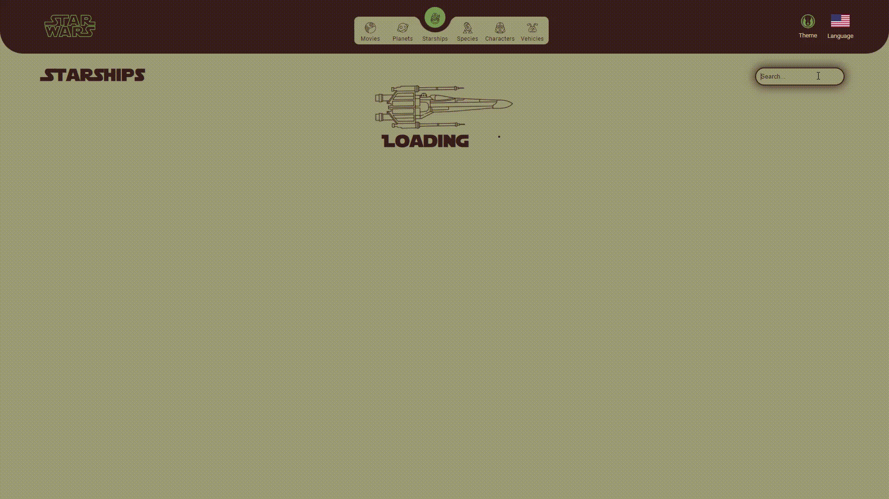
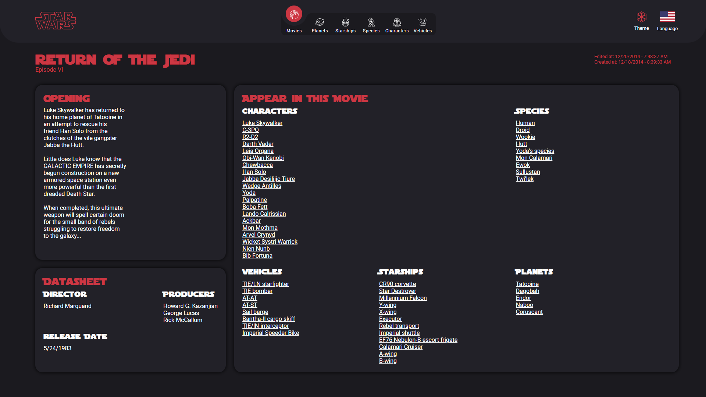

# Sobre o projeto

O projeto foi criado com o intuito de servir como portfólio, mostrando algumas habilidades que possuo no desenvolvimento de aplicações web. O [Star Wars Front-end](https://starwars-front.vercel.app/) trata-se de uma aplicação que exibe algumas informações a respeito dos 6 primeiros filmes do universo cinematográfico do Star Wars. A ideia foi criar um site que consumisse as informações fornecidas pela API [SWAPI](https://swapi.dev/) e mostrasse essas de uma forma criativa e que fizesse referência a elementos existentes no mundo do Star Wars.

# Funcionalidades

## Lista de categorias de informações

As informações exibidas na plataforma são fornecidas somente pela [SWAPI](https://swapi.dev/). Sendo elas:

[Filmes](https://starwars-front.vercel.app/movies/),
[Planetas](https://starwars-front.vercel.app/planets/),
[Naves](https://starwars-front.vercel.app/starships/),
[Espécies](https://starwars-front.vercel.app/species/),
[Personagens](https://starwars-front.vercel.app/characters/) e
[Veículos](https://starwars-front.vercel.app/vehicles/).

## Filtro dos conteúdos das categorias

## Paginação das informações

## Conteúdo detalhado

## Troca de temas

Com o intuito de fornecer uma experiência visual mais interessante para diversos tipos de perfis. Foram implementados 5 temas que fazem referências ao universo de Star Wars sendo eles:

**_Sith, Jedi, Império, Aliança, R2D2_**

## Tradução dos campos estáticos

Infelizmente a SWAPI não possui portabilidade para diferentes tipos de idiomas, desta forma foi feita somente a tradução dos campos definidos no front-end em dois idiomas: Inglês americano e em Português Brasileiro.

## Tecnologias utilizadas

O projeto foi desenvolvido utilizando as ferramentas: ReactJs, Typespcript, Vite, Recharts, Styled-components, React-router, I18next e React-spring.

# Executando o projeto

1. Instalar as depedências com: `npm install`
2. Executar o projeto na porta 3000 com o comando: `npm run dev`
3. Gerar a build do projeto: `npm run build`

# Curtiu o projeto? Você pode contribuir com:

## Ideias, Críticas ou com uma vaga de emprego ;)

Você pode me contactar pelo [Linkedin](https://www.linkedin.com/in/eduardo-nunes-081951151/). Ou pode criar uma issue aqui no repositório :D

## Adição de mais idiomas

Para a adição de uma nova tradução, seguir os 4 passos:

1. Dentro da pasta `locales`, criar uma pasta cujo o nome deve ser o código da linguagem que pretende-se adicionar (Ex: pt-br, es-es, en-us), em letras minúsculas. Após a pasta ser criada, dentro da pasta criada, adicionar um arquivo `translation.json`. Nesse será realizada a tradução dos termos do novo idioma ao qual a plataforma terá suporte.
2. Adicionar o código da linguagem (Ex: pt-br, es-es, en-us) na lista de `supportedLngs`, no arquivo `i18n.ts`
3. Adicionar uma imagem _.svg_ com a bandeira que representa o novo idioma na pasta `~/assets/icons/flags/`.
4. No arquivo `~/utils/languages_icons.tsx`, adicionar ao objeto `LANGUAGES_ICONS` a chave que é código da linguagem e como valor o _.svg_ da bandeira adicionada no passo anterior.

## Adição de temas

Para a adição de uma nova variação de tema, seguir os passos asseguir:

1. Criar um arquivo _.ts_, cujo o nome do arquivo é o nome do novo tema, dentro da pasta `~/styles/themes/`. Devesse seguir o padrão definido no arquivo `~/styles/styled.d.ts`.
2. Adicionar uma imagem _.svg_ com o ícone que representa o novo tema na pasta `~/assets/icons/themes/`, de preferência no formato circular.
3. No arquivo `~/styles/themes/themes_dict.tsx` adicionar como chave do objeto `THEMES` o nome do novo tema, e como valor um objeto com duas chaves sendo elas style (objeto contendo o estilo do tema, definido no passo 1) e icon (ícone do tema definido no passo 2).
